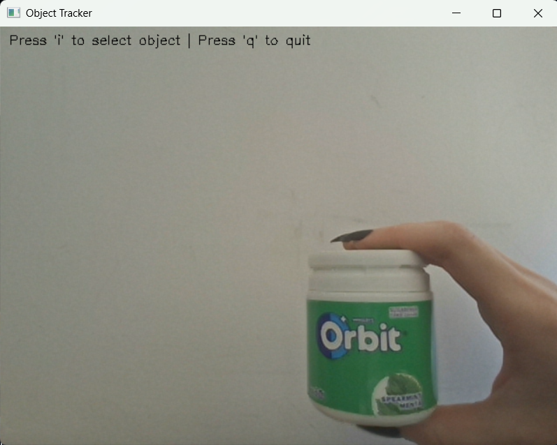
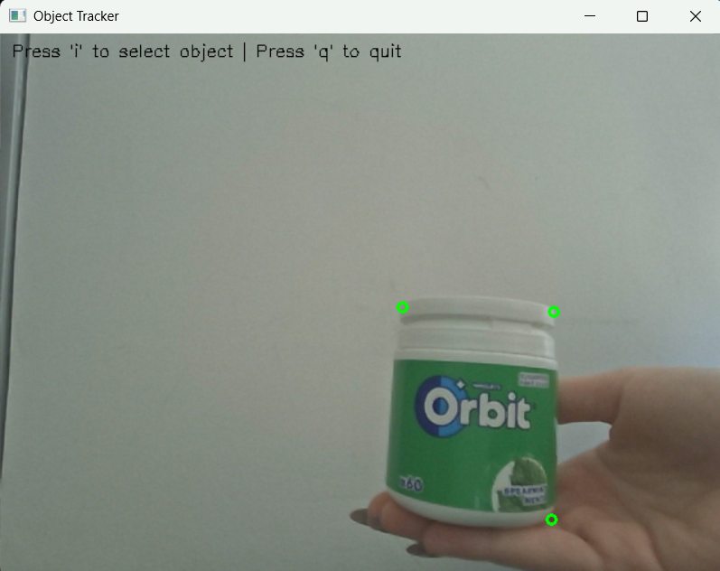
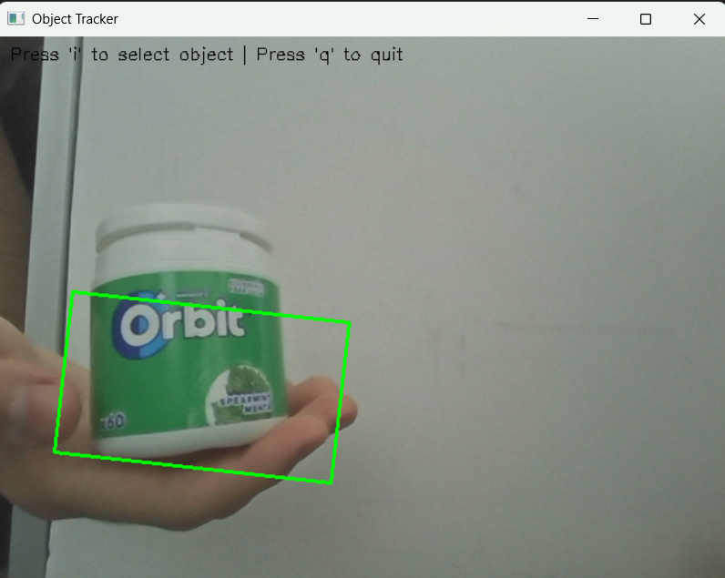

# cv2-object-tracker-camshift

A simple real-time object tracker using OpenCV and the CamShift (Continuously Adaptive Mean Shift) algorithm. This Python script allows users to select an object in a webcam feed and tracks its movement using color histograms and the CamShift algorithm.

## Features

- Real-time object tracking from webcam video
- User-friendly interactive selection of the object to track
- Tracks a wide variety of objects—including faces—using color histograms
- Uses color histogram back-projection for robust tracking
- Visualizes tracking with bounding polygons on the video stream
- Minimal dependencies (OpenCV and NumPy)

## Installation

1. **Clone the repository:**
   ```sh
   git clone https://github.com/TheSebitzu/cv2-object-tracker-camshift.git
   cd cv2-object-tracker-camshift
   ```

2. **Install requirements:**
   ```sh
   pip install opencv-python numpy
   ```

## Usage

Run the tracker script:

```sh
python tracker.py
```

- The webcam window will open.
- **Press `i`** to enter object selection mode.
- **Double-click four points** around the object you want to track.
- The tracker will start following the selected object—including faces or any other distinct object.
- **Press `q`** at any time to quit the program.

## How It Works

- The application captures video frames from your webcam.
- When you select an object (by double-clicking four points), it creates a color histogram of that region in HSV space.
- Each frame is processed with Gaussian Blur and HSV conversion.
- The CamShift algorithm is applied to track the object’s new position based on back-projection of the histogram.
- The tracked object is highlighted with a green polygon.

## Limitations

- **Tracking objects that are colored similarly to the background may not work reliably.**  
  If the object and the background have similar colors, the tracker may lose the object or track the wrong area. For best results, choose objects with distinct colors compared to their surroundings.

## Screenshots

| Initial View | Selecting Object | Tracking in Action |
|--------------|-----------------|-------------------|
|  |  |  |

## Requirements

- Python 3.x
- OpenCV (`opencv-python`)
- NumPy

## License

This project is licensed under the MIT License.

---

*Made by [TheSebitzu](https://github.com/TheSebitzu)*